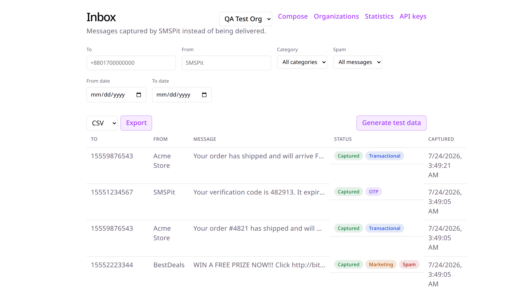

<p align="center">
  
</p>

# SMSPit

> **The Sandbox for SMS.**
>
> A modern, self-hosted SMS sandbox for local development, testing, and CI/CD. Capture, inspect, search, replay, and debug SMS messages without sending real SMS to mobile networks.

<p align="center">
  <a href="LICENSE"></a>
  <a href="https://github.com/jmrashed/SMSPit/stargazers"></a>
  <a href="https://github.com/jmrashed/SMSPit/issues"></a>
</p>

> **Status: v1.0 feature-complete, release pending.** Everything through v0.4 (SMS capture/search/replay, the dashboard, API-key auth, provider-compatible endpoints, multi-tenancy, templates, export, AI detection/classification/spam/test-data) plus all of v1.0's scope — Kubernetes manifests and a Helm chart, OpenTelemetry tracing, Prometheus metrics, Grafana dashboards, hardened multi-tenancy (per-org rate limiting), 4 native SDKs (PHP/Go/Node.js/Python), a full OpenAPI reference, and an extended CI/CD pipeline — are implemented and tested; see the [changelog](CHANGELOG.md) for the version-by-version detail and [docs/qa-day98.md](docs/qa-day98.md) for the pre-release QA pass. The `v1.0.0` tag itself, the published Docker images, and the SDK package registry publishes are the last step (checklist Days 96/100) — not yet done as of this commit. Follow progress in [checklist.md](checklist.md). Per-service stack and feature docs live in [docs/](docs/).

---

## Table of Contents

- [Why SMSPit?](#why-smspit)
- [Features](#features)
- [Screenshots](#screenshots)
- [Architecture](#architecture)
- [Tech Stack](#tech-stack)
- [Project Structure](#project-structure)
- [Quick Start](#quick-start)
- [Example Usage](#example-usage)
- [REST API](#rest-api)
- [Dashboard Features](#dashboard-features)
- [AI Features](#ai-features)
- [Provider Compatibility](#provider-compatibility)
- [Observability](#observability)
- [Roadmap](#roadmap)
- [SDKs](#sdks)
- [Contributing](#contributing)
- [License](#license)
- [Inspiration](#inspiration)
- [Support](#support)

---

## Why SMSPit?

Testing SMS integrations usually requires:

- Real phone numbers
- Paid SMS providers
- Network connectivity
- Provider credentials
- Manual verification

**SMSPit eliminates all of these.**

Simply point your application to SMSPit instead of a real SMS provider, and every outgoing SMS is captured in a beautiful web dashboard.

No SMS is actually delivered.

---

## Features

All shipped — see the [Roadmap](#roadmap) for which release introduced each.

- 📩 Capture outgoing SMS
- 🔍 Powerful search and filtering
- ⚡ Real-time dashboard
- 🔄 Replay SMS requests
- 📱 OTP detection, classification, and spam detection (AI-powered)
- 📦 REST API, fully documented via [OpenAPI](docs/openapi/openapi.yaml)
- 🔑 API Key authentication, rotation, and revocation
- 📊 Delivery statistics
- 📁 Export messages (CSV/JSON)
- 🧪 CI/CD friendly
- 🐳 Docker support, Kubernetes manifests, and a Helm chart
- 🌐 Multi-tenant (organizations, teams, per-org rate limiting)
- 📡 WebSocket live updates
- 📜 Request history
- 🔥 Provider emulation (Vonage, AWS SNS, MessageBird)
- ⚙️ OpenAPI documentation
- 📈 Prometheus metrics, Grafana dashboards, and OpenTelemetry tracing
- 🧰 Native SDKs (PHP, Go, Node.js, Python)

---

# Screenshots

The inbox — captured messages with AI-detected OTP, category, and spam badges:



---

# Architecture

```
                   +----------------------+
                   |    API Gateway (Go)  |
                   +----------+-----------+
                              |
          +-------------------+-------------------+
          |                   |                   |
          |                   |                   |
+---------v------+   +--------v-------+   +-------v-------+
| Auth Service   |   | SMS Service    |   | AI Service    |
| Laravel        |   | Node.js        |   | Python        |
+----------------+   +----------------+   +---------------+
                              |
                       Redis / NATS / Kafka
                              |
                    +---------v----------+
                    | Worker Service (Go)|
                    +---------+----------+
                              |
                        PostgreSQL
                              |
                    +---------v----------+
                    |  React Dashboard   |
                    +--------------------+
```

---

# Tech Stack

| Component | Technology |
|------------|------------|
| API Gateway | Go |
| Authentication | Laravel |
| SMS Service | NestJS |
| AI Service | FastAPI |
| Queue | Redis / NATS / Kafka |
| Database | PostgreSQL |
| Cache | Redis |
| Dashboard | React |
| Container | Docker |
| Monitoring | Prometheus + Grafana |
| Tracing | OpenTelemetry |

---

# Project Structure

All service folders below are fully implemented, not just scaffolded — see [checklist.md](checklist.md) for the day-by-day build history.

```
SMSPit/
├── gateway/                       # API Gateway (Go)
│   ├── cmd/
│   │   └── gateway/
│   │       └── main.go
│   ├── internal/
│   │   ├── router/
│   │   ├── middleware/
│   │   └── proxy/
│   ├── config/
│   ├── Dockerfile
│   └── go.mod
│
├── auth-service/                  # Authentication & API Keys (Laravel)
│   ├── app/
│   │   ├── Http/Controllers/
│   │   ├── Models/
│   │   └── Services/
│   ├── routes/
│   ├── database/migrations/
│   ├── tests/
│   ├── Dockerfile
│   └── composer.json
│
├── sms-service/                   # SMS Capture & Replay (NestJS)
│   ├── src/
│   │   ├── messages/
│   │   ├── websocket/
│   │   ├── providers/
│   │   └── main.ts
│   ├── test/
│   ├── Dockerfile
│   └── package.json
│
├── ai-service/                    # OTP/Spam Detection, Classification (FastAPI)
│   ├── app/
│   │   ├── routers/
│   │   ├── schemas/
│   │   ├── services/
│   │   ├── config.py
│   │   └── main.py
│   ├── tests/
│   ├── Dockerfile
│   └── requirements.txt
│
├── worker/                        # Background Jobs / Queue Consumers (Go)
│   ├── cmd/
│   │   └── worker/
│   │       └── main.go
│   ├── internal/
│   │   ├── consumer/
│   │   ├── queue/
│   │   └── aiclient/
│   ├── config/
│   ├── Dockerfile
│   └── go.mod
│
├── dashboard/                     # Web Dashboard (React)
│   ├── src/
│   │   ├── components/
│   │   ├── pages/
│   │   ├── hooks/
│   │   ├── api/
│   │   └── App.tsx
│   ├── public/
│   ├── Dockerfile
│   └── package.json
│
├── proto/                         # Shared gRPC/protobuf definitions
│   └── sms/v1/
│
├── docs/                          # Documentation & diagrams
│   ├── images/
│   ├── api/
│   └── architecture.md
│
├── docker/                        # Shared Dockerfiles / compose fragments
│   └── base/
│
├── deployments/                   # Kubernetes, Helm charts, environment configs
│   ├── k8s/
│   └── helm/
│
├── scripts/                       # Dev & CI helper scripts, plus load-test/ (Day 88)
│   ├── setup.sh
│   ├── dev-up.sh
│   └── load-test/
│
├── sdks/                          # Native client SDKs (Days 89-93)
│   ├── php/
│   ├── go/
│   ├── nodejs/
│   └── python/
│
├── docker-compose.yml             # wires gateway + auth-service + sms-service + ai-service + worker + dashboard + Postgres + Redis + Jaeger + Prometheus + Grafana
├── checklist.md                   # 100-day build checklist
├── CLAUDE.md                      # AI agent working guide
├── LICENSE
└── README.md
```

---

# Quick Start

`docker-compose.yml` wires up all 8 services (`gateway`, `auth-service`, `sms-service`, `ai-service`, `worker`, `dashboard`, Postgres, Redis) plus the observability stack (Jaeger, Prometheus, Grafana). `docker compose up -d` itself hasn't been run/verified in the environment this was built in (no Docker available during development) — see [CHANGELOG.md](CHANGELOG.md#known-gaps) and [docs/production-deployment.md](docs/production-deployment.md) for what was verified instead, and re-verify against a real `docker compose up -d` before depending on it. `scripts/dev-up.sh` is the Docker-free alternative used throughout this project's own development.

All API requests require an API key: generate one via `POST /api/api-keys` on `auth-service` (or the dashboard's own `/api-keys` page, which needs no key itself to get in) and pass it as `Authorization: Bearer <key>` against the gateway.

## Clone

```bash
git clone https://github.com/jmrashed/SMSPit.git

cd SMSPit
```

## Start

```bash
docker compose up -d
```

Open

```
Dashboard

http://localhost:5173
```

API

```
http://localhost:8080
```

---

# Example Usage

The idea: point your app at SMSPit instead of your real SMS provider. No code change beyond configuration — every message gets captured, not delivered.

## Before — sending via your SMS provider's SDK

```php
$provider = new SmsClient($apiKey);

$provider->messages->send(
    "+8801700000000",
    [
        "from" => "SMSPit",
        "body" => "Your OTP is 845231",
    ]
);
```

## After — pointing at SMSPit

Swap your provider's base URL for your local SMSPit instance (works out of the box if your SDK lets you override the base URL, or via a [compatible adapter](#provider-compatibility) for providers SMSPit emulates):

```php
$provider = new SmsClient($apiKey, [
    "baseUri" => "http://localhost:8080",
]);
```

Or call the native SMSPit REST API directly from any language:

```bash
curl -X POST http://localhost:8080/api/v1/messages \
  -H "Authorization: Bearer $SMSPIT_API_KEY" \
  -H "Content-Type: application/json" \
  -d '{
        "to": "+8801700000000",
        "from": "SMSPit",
        "message": "Your OTP is 845231"
      }'
```

```json
{
  "id": "sms_123456",
  "status": "captured"
}
```

The message appears instantly in the dashboard — no network call leaves your machine, and no real SMS is sent.

---

# REST API

Every endpoint below requires `Authorization: Bearer <api key>` (validated against `auth-service` at the gateway, and again at `sms-service` itself for defense in depth), except the [provider-compatible adapters](#provider-compatibility) and the API key bootstrap/management routes, which are intentionally unauthenticated (see [docs/security.md](docs/security.md)). This is a summary — the full, versioned contract (request/response schemas, every status code) is in [docs/openapi/openapi.yaml](docs/openapi/openapi.yaml), also viewable via [docs/openapi/site/index.html](docs/openapi/site/index.html).

## Send SMS

```http
POST /api/v1/messages
```

```json
{
  "to": "+8801700000000",
  "from": "SMSPit",
  "message": "Your OTP is 845231"
}
```

Response

```json
{
  "id":"sms_123456",
  "status":"captured"
}
```

---

## List Messages

```
GET /api/v1/messages
```

---

## Message Details

```
GET /api/v1/messages/{id}
```

---

## Delete Messages

```
DELETE /api/v1/messages
```

---

## Replay

```
POST /api/v1/messages/{id}/replay
```

---

## Statistics

```
GET /api/v1/statistics
```

---

## Export Messages

```
GET /api/v1/messages/export?format=csv
GET /api/v1/messages/export?format=json
```

Same filters as List Messages (`to`, `from`, `created_after`, `created_before`); streamed as an attachment, so a `Content-Disposition` header carries the suggested filename.

---

## Message Templates

```
GET    /api/v1/templates
POST   /api/v1/templates
GET    /api/v1/templates/{id}
PUT    /api/v1/templates/{id}
DELETE /api/v1/templates/{id}
```

Templates support `{{variable}}` placeholders, filled in at send time.

---

## Organizations & Teams

```
GET    /api/organizations
POST   /api/organizations
GET    /api/organizations/{id}
PUT    /api/organizations/{id}
DELETE /api/organizations/{id}
GET    /api/organizations/{id}/teams
POST   /api/organizations/{id}/teams
POST   /api/organizations/{id}/teams/{team}/members
DELETE /api/organizations/{id}/teams/{team}/members/{user}
```

Served by `auth-service` (paths above as seen directly on `auth-service`; through the gateway, prefix with `/auth` instead of `/api` — e.g. `POST /auth/organizations`). An API key scoped to an organization only sees that organization's messages, keys, and templates; ungrouped keys (no organization) see only ungrouped data — organization membership is a partition, not a wildcard.

---

# Dashboard Features

- Inbox
- Search
- Filters
- Raw Request
- Headers
- Replay
- Export
- API Logs
- Timeline
- WebSocket Updates
- Organization/Team Switcher
- Template Picker
- OTP Badge & Copy-to-Clipboard
- Classification Tags
- Spam Flag & Manual Override
- Generate Test Data

---

# AI Features

`ai-service` (FastAPI) provides OTP detection, message classification, spam detection, and synthetic test-data generation. `sms-service` calls it synchronously (with a short timeout) on every message capture — AI enrichment never blocks or fails a capture, and degrades to "not detected" if `ai-service` is unreachable. `worker` (Go) additionally consumes a Redis Streams queue (`sms.messages.created`, published by `sms-service` on capture) for its own async workloads on top of `ai-service` — see [docs/redis.md](docs/redis.md) for the full architecture.

| Endpoint | Purpose |
|---|---|
| `POST /detect-otp` | Regex-based OTP extraction |
| `POST /classify` | Rule-based category: `otp` / `transactional` / `marketing` / `other` |
| `POST /detect-spam` | Keyword/heuristic spam scoring (`is_spam`, `score`) |
| `POST /generate-test-data` | Synthetic SMS samples (`count`, `type`), for exercising the dashboard/API without a real integration |

Captured messages carry `otp`, `category`, and `is_spam` fields (see [REST API](#rest-api)); the dashboard surfaces these as a copyable OTP badge, a classification tag, and a spam flag with a manual "mark as not spam" override.

---

# Provider Compatibility

SMSPit exposes drop-in-compatible endpoints for popular SMS providers, so an application can point its existing SDK at SMSPit by swapping the base URL — no other code changes. See [docs/api/provider-compatibility.md](docs/api/provider-compatibility.md) for the full path convention and field mappings.

Shipped (v0.3):

- Vonage — `POST /providers/vonage/sms/json`
- AWS SNS — `POST /providers/sns`
- MessageBird — `POST /providers/messagebird/messages`

Planned:

- Infobip
- Plivo
- Clickatell

These endpoints are unauthenticated by design, matching the "swap the base URL, nothing else" premise — they don't sit behind `/api/v1` and aren't covered by API-key auth.

---

# Observability

Every service exposes Prometheus metrics (`/metrics`) and emits OpenTelemetry traces, wired into `docker-compose.yml` alongside Jaeger, Prometheus, and pre-provisioned Grafana dashboards (request rate/latency/error rate, message volume, OTP detection rate). See [docs/observability.md](docs/observability.md) for the full setup and how it was verified in an environment without Docker.

---

# Roadmap

## v0.1 — shipped

- SMS Capture
- Dashboard
- Search
- REST API
- Docker

---

## v0.2 — shipped

- Authentication
- API Keys
- Replay
- Statistics
- WebSocket

---

## v0.3 — shipped

- Provider Emulation
- Teams
- Organizations
- Message Templates
- Export

---

## v0.4 — shipped

- AI OTP Detection
- AI Classification
- AI Spam Detection
- AI Test Data Generator

---

## v1.0 — implemented, release pending

- Kubernetes manifests + Helm chart
- OpenTelemetry tracing
- Prometheus metrics + Grafana dashboards
- Hardened multi-tenancy (org-scoping audit, per-org rate limiting)
- Security review (secrets management, API key rotation, input validation)
- Load testing (found and fixed a real concurrency bottleneck — see [docs/load-testing.md](docs/load-testing.md))
- Native SDKs (PHP, Go, Node.js, Python)
- Full OpenAPI reference + Swagger UI docs site
- Extended CI/CD (every service tested on every PR, image publishing, staging deploy)
- Production deployment guide
- End-to-end QA pass (found and fixed a real routing bug — see [docs/qa-day98.md](docs/qa-day98.md))

Not yet done: publishing images/SDKs to their registries and tagging the `v1.0.0` release itself (checklist Days 96/100) — everything else above is implemented and tested.

---

# SDKs

- PHP, Go, Node.js, Python — built (checklist Days 89-92), see [docs/sdks.md](docs/sdks.md) and each SDK's own README under [sdks/](sdks/). Not yet published to a package registry.
- Java, .NET — planned, not yet started.

---

# Contributing

Contributions are welcome — see [CONTRIBUTING.md](CONTRIBUTING.md) for setup, testing, and PR conventions. [checklist.md](checklist.md) tracks build history and what's still open, and [CLAUDE.md](CLAUDE.md) documents this repo's full working conventions.

---

# License

Released under the MIT License.

---

# Inspiration

SMSPit is inspired by developer tools that make local development faster and more enjoyable, such as:

- Mailpit
- MailHog
- MockServer
- WireMock
- LocalStack

---

# Support

If you find SMSPit useful, please consider:

⭐ Star the repository

🐛 Report bugs

💡 Suggest new features

🤝 Contribute to the project

---

<p align="center">
Made with ❤️ for developers.
</p>
